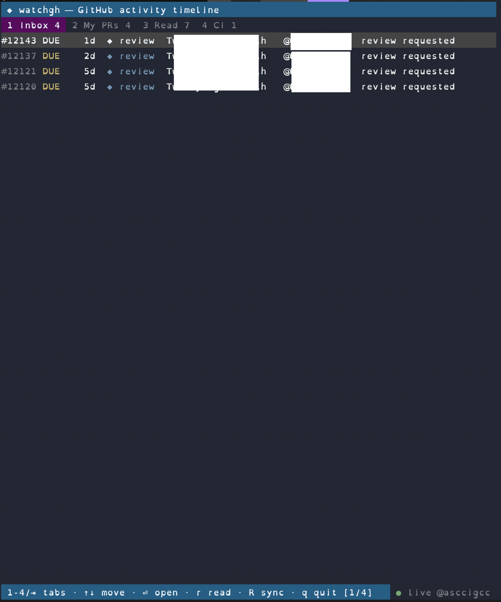

# watchgh

A GitHub activity timeline for your terminal. It shows the pull requests,
reviews, and CI runs that need you, in the order they arrive.

Run `wgh` to open the timeline. It also starts a background poller that keeps
GitHub in sync and sends desktop notifications when something needs you, even
when no window is open. It signs in with your existing GitHub credentials
(`GITHUB_TOKEN` if set, otherwise `gh auth token`).

> **Status:** a personal pet project, maintained solo and as time allows. Shared
> in case it's useful. Issues and pull requests are welcome; I review them when I
> can, so replies may be slow, and small, focused changes get merged fastest. See
> [CONTRIBUTING.md](CONTRIBUTING.md). Fork it freely under MIT.



## Install

macOS only. The installer downloads the prebuilt `wgh` binary from the latest
GitHub release and puts it on your PATH. No Go toolchain needed.

```sh
curl -fsSL https://raw.githubusercontent.com/asccigcc/watchgh/main/install.sh | bash
```

It installs to `/usr/local/bin/wgh`. Set `BINDIR` to change that, or `WGH_TAG`
to pin a specific release:

```sh
BINDIR=/opt/homebrew/bin WGH_TAG=v0.1.0 bash install.sh
```

## Update

`wgh` is a single binary, so updating just means re-running the installer. It
always fetches the latest release:

```sh
curl -fsSL https://raw.githubusercontent.com/asccigcc/watchgh/main/install.sh | bash
```

(While the repo is private, run `bash install.sh` from a checkout with the
GitHub CLI signed in, or pin a build with `WGH_TAG=v0.5.0`.)

Then **restart the background poller** so it runs the new binary:

```sh
wgh stop   # stop the running poller
wgh        # reinstall and start it on the updated binary
```

This step matters. The poller runs continuously, so replacing the file on disk
doesn't change the copy already running in memory. The old one keeps going until
you restart it. `wgh stop && wgh` swaps in the updated binary in one step.

## Commands

```sh
wgh          # interactive timeline (prints plain text when piped)
wgh open 42  # open item 42 in the browser, mark it read (here and on GitHub)
wgh read 42  # mark item 42 read without opening
wgh stop     # stop the background poller (restarts next time you open wgh)
```

## Interactive timeline

Run `wgh` in a terminal to open a full-screen timeline. When piped or
redirected, it prints plain text so scripts keep working.

The window stays live. It re-reads its local data every couple of seconds, so
anything the background poller picks up shows up on its own, and it refreshes on
launch and when you press `R`. A `⟳ syncing` marker in the title bar means a
sync is in flight, and the footer shows whether the background poller is
running. (If it isn't, the open window checks GitHub itself.)

Four tabs, each with a live count:

| Tab | Shows |
| --- | --- |
| 1 Inbox | unread items others put on you: review requests and assignments |
| 2 My PRs | every open PR you own, with its latest activity or CI and merge state |
| 3 Read | items you've already handled |
| 4 CI | build pass or fail, and blocked or clean, on your tracked PRs |

| Key | Action |
| --- | --- |
| 1-4, Tab | switch tab (Tab cycles) |
| ↑/↓, k/j | move the selection |
| g / G | jump to newest / oldest |
| PgUp/PgDn | page by a screenful |
| ⏎ | open the selected item in the browser and mark it read |
| r | mark read without opening |
| R | check GitHub now |
| q / Esc / Ctrl-C | quit |

## Background poller

The first time you open `wgh`, it installs a small background service (a launchd
agent named `com.watchgh.poller`) that runs `wgh` on its own. macOS keeps it
alive across logins and reboots, so it checks GitHub every few minutes and sends
desktop notifications even when no window is open.

Notifications are grouped by type into a running count of what needs you: "3
reviews requested", "2 PRs assigned to you", "2 PRs failing CI", "1 PR blocked",
"2 PRs need your reply". You get one notification per type instead of one per
event, and it only re-alerts when the count goes up. Open `wgh` to see the
items, and the count clears as you handle them. The first check after starting
is silent, so a cold start doesn't alert you about your whole backlog.

```sh
wgh stop   # stop the poller and remove its service
wgh        # opening wgh again reinstalls and starts it
```

For notifications, install `terminal-notifier` (`brew install
terminal-notifier`) and each count updates its banner in place. Without it,
`wgh` shows a single summary banner instead. The poller runs with a minimal
environment, so it reads your token from `gh auth token`; make sure the GitHub
CLI is signed in (`gh auth login`). Its log is at
`~/Library/Application Support/watchgh/poller.log`.

## Configuration

An optional `config.toml` sits next to the data file
(`~/Library/Application Support/watchgh/config.toml`). It's flat `key = value`,
every key is optional, and a malformed file falls back to the defaults. See
[`config.example.toml`](config.example.toml) for the full list.

The poll interval controls how often the background poller checks GitHub. It
defaults to `5m` (minimum `60s`). Desktop notifications pull you in and `R`
refreshes on demand, so polling more often rarely pays for the extra traffic.

Data lives in a SQLite file at
`~/Library/Application Support/watchgh/watchgh.db`. Read items are removed after
30 days (set with `retention`); unread items are kept. PRs that merge or close
drop out of every tab on the next check, so a finished PR never lingers in Read.

## License

MIT. See [LICENSE](LICENSE).
